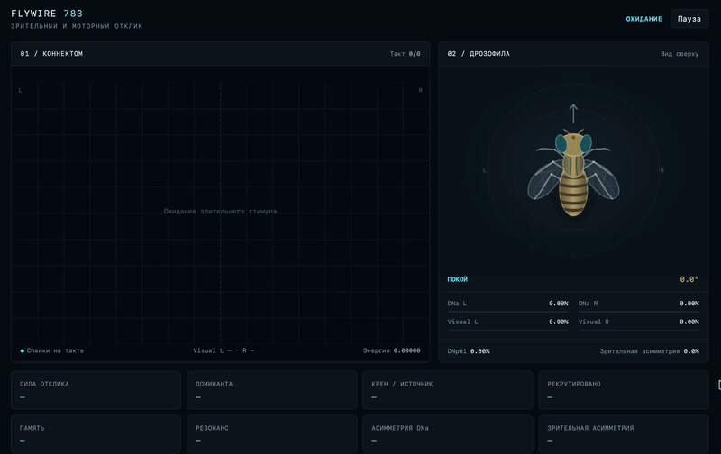
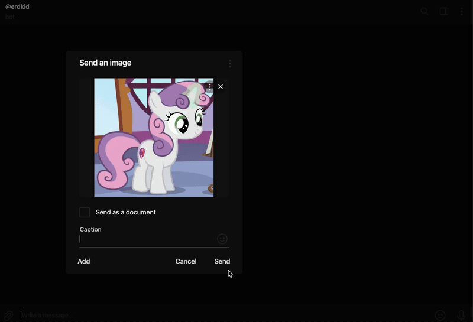

<div align="center">

# 🪰 FlyWire Connectome Critic & Visualizer

**Биологически достоверная симуляция коннектома мозга дрозофилы (*Drosophila melanogaster*) в реальном времени.**  
Пропускает изображение через сетчатку, разгоняет спайковую волну по 138 000+ реальным нейронам и транслирует моторный отклик и «мысли» мухи в веб-интерфейс и Telegram-бота.

[](https://www.python.org/)
[](https://fastapi.tiangolo.com/)
[](https://aiogram.dev/)
[](https://scipy.org/)
[](https://apple.com)

</div>

---

## 🎬 Демонстрация работы

| Веб-интерфейс (Проекция коннектома 60 FPS) | Отклик мухи и Telegram-бот |
| :---: | :---: |
|  <br><sub>*Проекция спайков коннектома в реальном времени*</sub> |  <br><sub>*Отправка фото боту и моторная реакция дрозофилы*</sub> |

<!-- Дополнительное место под полноэкранную гифку -->
<!--
<div align="center">
  
</div>
-->

---

## 💡 О проекте

В основе проекта лежит полный оцифрованный коннектом мозга взрослой дрозофилы **FlyWire release 783**:
- **138 639** идентифицированных нейронов;
- **15 091 983** синаптических соединений;
- Реальные анатомические аннотации типов клеток, полушарий и нейротрансмиттеров.

Вместо обучения искусственных сетей проект запускает **биофизическую импульсную сеть (SNN)** на базе графа синапсов реального живого существа. При отправке фотографии боту зрительный стимул активирует рецепторы сетчатки мухи, сигнал распространяется по коннектому, а поведенческий декодер переводит активность функциональных нейронных пулов в физический поворот тела, реакцию избегания и эмоциональный отклик.

---

## ⚡ Особенности реализации

- **Высокоэффективная работа с памятью**:
  - Граф связей парсится батчами через `pyarrow.ipc` без загрузки всего 850+ МБ датасета в память целиком.
  - Матрица смежности хранится в виде нормализованной по входам разреженной матрицы `scipy.sparse.csr_matrix` (всего ~120 МБ в RAM).
  - Плотная матрица 138k × 138k никогда не создаётся.

- **Биофизика спайков (Adaptive Leaky Integrate-and-Fire)**:
  - Мембранный потенциал с затуханием $\exp(-1/8)$.
  - Адаптация частоты спайков (Spike-Frequency Adaptation, SFA).
  - Кратковременная синаптическая депрессия (Short-Term Depression, STD) при частых спайках.
  - Абсолютный и относительный рефрактерные периоды с защитой от целочисленного переполнения.

- **Сетчатка (Retina Encoder)**:
  - Входное изображение ресайзится до 32×32 и фильтруется разностью гауссиан (DoG: $G(0.9) - G(2.6)$).
  - Пространственное разделение на ON/OFF каналы и анатомическая проекция в левую и правую оптические доли (*optic lobes*).

- **Биологическое декодирование поведения**:
  - **DNa01 / DNa02**: нисходящие нейроны поворота тела (руление влево/вправо).
  - **DNp01**: классический контур избегания и паники при опасности (*looming/escape*).
  - **SEZ / GRN / Gustatory**: пищевые нейроны и интерес к еде.
  - **Central Complex (CX)**: ориентация и пространственная интеграция.

- **Реактивный Canvas Dashboard**:
  - WebSocket-стриминг спайков через `np.argpartition` $O(N)$ без лишних аллокаций.
  - 2D анатомическая проекция мозга дрозофилы на HTML5 Canvas.
  - Визуализация поворота тела мухи в зависимости от соотношения возбуждения левого/правого контуров DNa.

---

## 💻 Аппаратные требования и бенчмарки

> [!NOTE]
> Все замеры и тестирование проводились на базовом **Apple MacBook Air M1**.

| Параметр | Значение (MacBook Air M1) |
| :--- | :--- |
| **Время холодной загрузки коннектома** | **~11.5 сек** |
| **Количество узлов (нейронов)** | **138 639** |
| **Количество синапсов (ненулевых CSR)** | **15 091 983** |
| **Размер CSR-матрицы в RAM** | **~121 МБ** |
| **Пиковый расход памяти (RSS при загрузке)** | **~612 МБ** |
| **Пиковый расход памяти (RSS во время симуляции)** | **~710 МБ** |
| **FPS стриминга в браузер** | **~60 FPS** (до 250 ключевых спайков/такт) |

Симуляция комфортно укладывается даже в 1 ГБ оперативной памяти и работает локально без дискретной видеокарты.

---

## 🛠️ Установка и запуск

### 1. Клонирование репозитория

```bash
git clone https://github.com/your-username/flywire-connectome-critic.git
cd flywire-connectome-critic
```

### 2. Создание виртуального окружения

```bash
python3 -m venv .venv
source .venv/bin/activate
pip install -r requirements.txt
```

### 3. Данные коннектома

Для запуска требуются два файла данных релиза **FlyWire v783** (положите их в корень проекта или укажите пути в `.env`):

1. **`proofread_connections_783.feather`** (~852 МБ) — граф выверенных синаптических связей между нейронами (`pre_pt_root_id`, `post_pt_root_id`, `syn_count`).
2. **`annotations.tsv`** (~31 МБ) — анатомические аннотации клеток: типы (`cell_class`, `cell_type`), полушария (`side`), нейротрансмиттеры (`top_nt`) и координаты (`soma_x, soma_y` / `pos_x, pos_y`).

#### 📥 Откуда скачать:
- **Официальный портал Codex (FlyWire / Princeton)**: [codex.flywire.ai/api/download](https://codex.flywire.ai/)
- Релиз коннектома: **Public Release v783** (раздел *Synapse table / Proofread connections* и *Cell annotations table*).
- Также данные доступны в архивах публикаций FlyWire консорциума на [Zenodo](https://zenodo.org/) (по запросу `FlyWire whole-brain connectome v783`).

> [!TIP]
> Из-за ограничений GitHub на размер файлов (>100 МБ) эти датасеты добавлены в `.gitignore` и не хранятся в репозитории. После скачивания просто скопируйте их в папку с проектом.

### 4. Настройка `.env`

Скопируйте пример конфига:
```bash
cp .env.example .env
```

Отредактируйте `.env`:
```ini
# Токен вашего бота от @BotFather
TELEGRAM_BOT_TOKEN=123456789:ABCdefGhIJKlmNoPQRsTUVwxyZ

# Пути к данным коннектома
CONNECTOME_PATH=proofread_connections_783.feather
ANNOTATIONS_PATH=annotations.tsv

# Число тактов симуляции на кадр (25-30)
SIM_STEPS=30

# Сервер дашборда
HOST=127.0.0.1
PORT=8000
LOG_LEVEL=INFO
```

### 5. Запуск

```bash
python3 parse_brain.py
```

1. Откройте в браузере дашборд: **http://127.0.0.1:8000**
2. Отправьте любое фото или картинку вашему Telegram-боту.
3. Наблюдайте в реальном времени, как спайковая волна проходит через зрительные доли и синапсы, и читайте вердикт мухи!

---

## 📁 Структура проекта

```text
├── parse_brain.py        # Основное приложение: SNN-пайплайн, FastAPI, WebSockets, Telegram-бот и UI
├── connectome_core.py     # Модульный движок загрузки графа, RetinaEncoder и симулятора
├── streaming.py          # Низкозатратный WebSocket-протокол для передачи спайков
├── requirements.txt      # Зависимости проекта (numpy, scipy, polars, pyarrow, aiogram, etc.)
├── .env.example          # Шаблон переменных окружения
├── .gitignore            # Игнорирование секретов, тяжелых feather/tsv и кешей
└── docs/
    └── media/            # Гифки и медиа для демонстрации в README
```

---

## 📜 Лицензия

Распространяется под лицензией MIT. Данные коннектома принадлежат консорциуму FlyWire / Princeton University.
